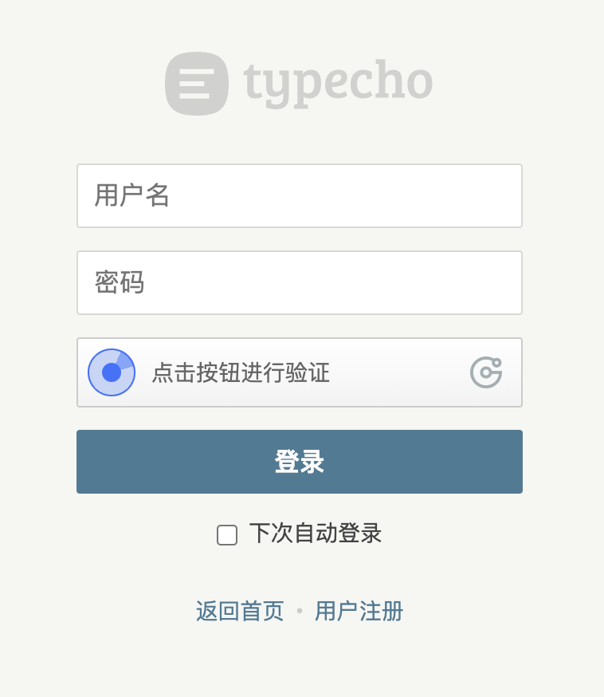
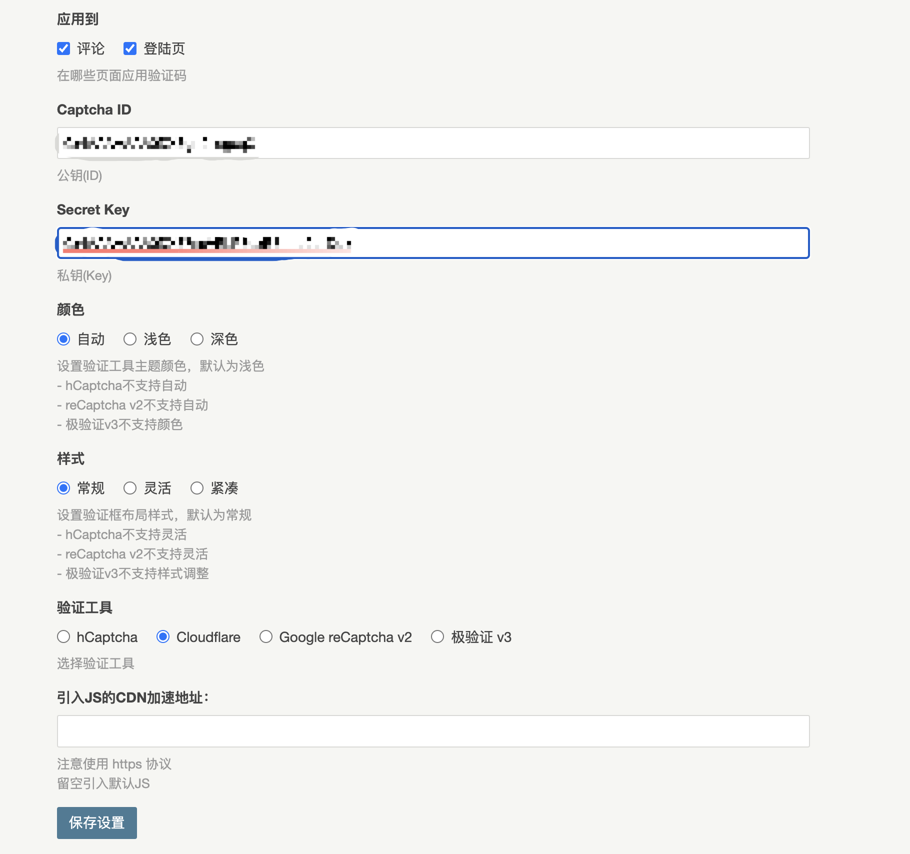
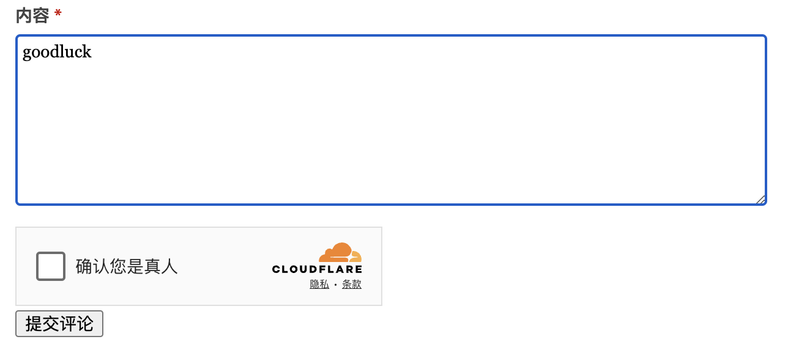

# XCaptcha-for-Typecho

用于Typecho博客系统的插件，为你的博客评论、注册、登陆添加验证码。


## 支持

目前支持的验证码如下：

* [hCaptcha](https://www.hcaptcha.com)
* [Cloudflare Turnstile](https://www.cloudflare.com)
* [Google reCaptcha v2](https://developers.google.cn/recaptcha/docs/display?hl=zh-cn)
* [极验证Geetest v3](https://www2.geetest.com)
* [altcha-org](https://altcha.org/docs/get-started/)

考虑接下来支持：
* Google reCaptcha v3
* 极验证Geetest v4


## 使用方式

### 下载本项目

可以通过Git获取本项目：

```sh
git clone https://github.com/CairBin/XCaptcha.git
```

或者下载本项目的压缩包

```sh
wget https://github.com/CairBin/XCaptcha/archive/refs/heads/main.zip
```


以上两种方式通常包含插件最近提交的代码，包括正在开发的功能和补丁，但也有可能不稳定，建议去[Release页面](https://github.com/CairBin/XCaptcha/releases/latest)下载Release版本。


解压后需要将插件文件夹的名称改为`XCaptcha`。


### 配置插件

将`XCaptcha`文件夹上传到你的Typecho博客的`usr/plugins/`目录下，在Typecho后台的插件面板里激活即可。

从上述所支持验证码的官网注册账户，然后获取你站点的`Captcha ID`和`Secret Key`，有的也叫`Site Key`和`Secret Key`，本质上都一样，对应公钥和私钥。前者用于前端标识可以公开，后者用于服务端向验证码服务器校验需要保密。

修改主题模板的`comments.php`文件，主题目录是`usr/themes/your_theme/`，在评论提交按钮之前或者表单最后添加一行代码，然后回到博客后台配置插件，将获取到的ID/Key填写进去，以及配置其他参数即可。

```php
<?php if (array_key_exists('XCaptcha', Typecho_Plugin::export()['activated'])) : XCaptcha_Plugin::showCaptcha(); endif; ?>
```

如果你想要禁用评论提交按钮，经过验证后才可点击提交表单，只需要给按钮添加类`custom-submit-button`即可，以默认主题为例：

```php
<button type="submit" class="custom-submit-button submit"><?php _e('提交评论'); ?></button>
```


部分主题可能不存在`comments.php`文件，这时候你需要从其他文件里找到评论表单，并在合适的位置添加这行代码。

## 插件导致无法登陆后台

登陆页面启用验证码，如果配置不当，会导致验证一直失败而无法进入博客后台。

如果遇到这种问题，请修改Typecho的数据库的`typecho_options`表中，`name`属性为`plugins`的那一行的值为`a:0:{}`以禁用所有插件。


**非常重要：在进行此操作前请务必备份数据库！**


## URL参数填写说明


* “验证码JS地址”取决于网络情况，它会替代原本引入的验证初始化脚本（不是二次验证的接口），遇到某些JS加载缓慢时使用，**如果不明白留空即可**。“校验地址”用于更换服务端验证接口，留空使用默认地址，一般在默认接口无法访问或者失效时填写。

* 区分JQuery CDN URL与上述部分，JQuery CDN URL用于通过CDN引入JQuery（不能留空），默认使用jsdelivr，而上述部分是用于**初始化/校验**验证码。

* 如果勾选了开启登陆页面验证码则，注册页面也会跟着开启，前提是你启动了注册功能。


## PJAX回调问题

据反馈部分主题开启PJAX无刷新后可能会导致验证码加载不正常，请根据主题自行设置PJAX回调函数。Handsome主题经过测试可以正常使用，其他主题若存在此问题请在issue反馈，但是部分作者没使用过的付费主题可能难以适配。

## PHP8兼容性问题

于v1.3.0正式版兼容PHP8，并在PHP82环境下通过测试。详细请参看“重要版本说明”部分和[CHANGELOG.md](./CHANGELOG.md)。


## 重要版本说明

### 关于v1.1.0及后续版本

* XCaptcha v1.1.0及后续版本，极验证加载不再依赖JQuery，启用JQuery与JQuery CDN URL项已经被移除。
* 自此版本起兼容旧版本的Typecho 1.1

### 关于v1.2.1版本及后续版本

通过移除./includes/XCaptcha_Config.php的personalConfig方法，修复Typecho控制台 -> 个人配置 显示XCaptcha配置找不到的bug(issue #1 )


### 关于v1.3.0及后续版本

* v1.3.0版本添加了渲染组件成功以及校验成功的回调函数，用于**禁用/启用按钮**以及提示**验证码组件正在加载**，因此对于`hcaptcha`、`cloudflare`以及`recaptcha`在配置`cdnUrl`的时候需要设置`onload`参数为`beforeCheckCallback`，例如`https://hcaptcha.com/1/api.js?onload=beforeCheckCallback`（更具体的参数配置并不属于本文范畴，你应当参考所使用验证码的官方文档）

* v1.3.0本分为预发布测试版和正式版，预发布版本存在altcha评论错误以及PHP8下极验证无法渲染问题，在v1.3.0正式版已经修复，Release页面的预发布版本已经删除，现在可下载的都是正式版本，建议及时更新。


## 反馈

反馈bug请提交issue仓库，请务必声明Typecho版本号、XCaptcha版本号、使用主题、Apache版本/Nginx版本等信息，方便问题复现。此外最好备注站点信息，方便作者查看问题。


## 项目展示








## 特别感谢

本项目在编写时参考的插件项目：

* [noisky/typecho-plugin-geetest](https://github.com/noisky/typecho-plugin-geetest)
* [scenery/typecho-plugins/CaptchPlus](https://github.com/scenery/typecho-plugins)
